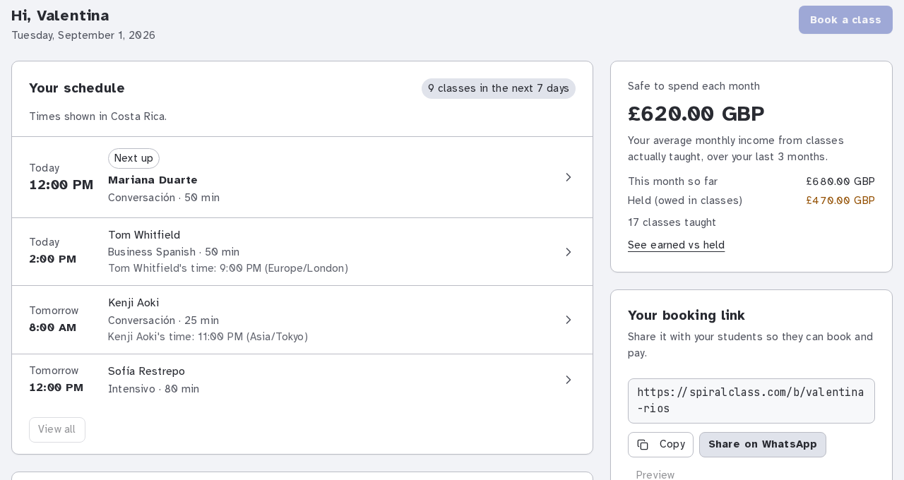
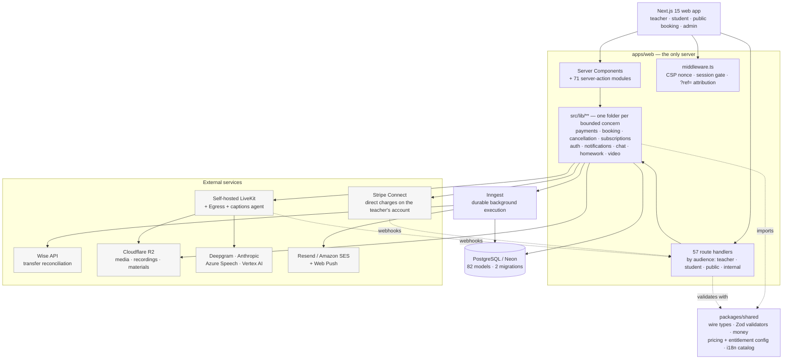
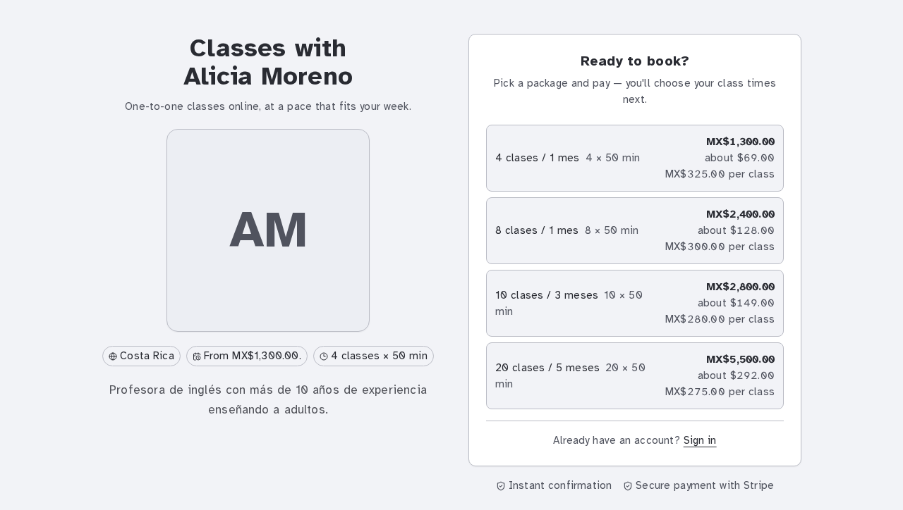
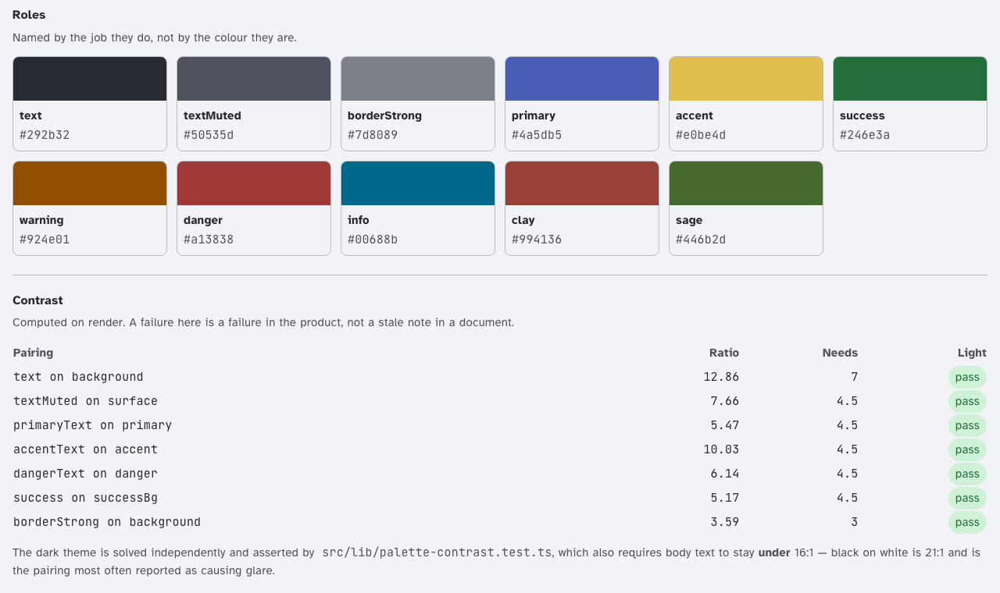
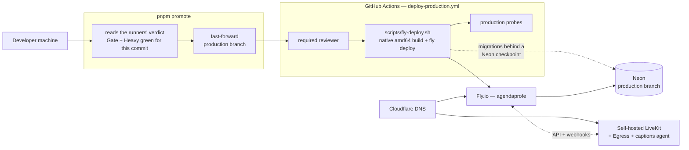

# SpiralClass

[](https://github.com/jaystewartuk/spiralclass/actions/workflows/gate.yml)
[](LICENSE)

<!-- The two deploy workflows deliberately have no badge. Preview's is
     suspended (D-150 moves preview to an Oracle ARM box; its workflow keeps
     only a manual trigger until that box serves), so a badge would report the
     health of something that is not running. Production's runs behind a
     required reviewer, where a green badge would mostly mean "nobody has
     promoted lately". Add them back if either changes. -->

**A scheduling, payments and video platform for independent teachers of any
subject.** It runs in production at [spiralclass.com](https://spiralclass.com)
on live payment rails, with real teachers and their students on it, and this
repository is the whole of it.

A teacher signs up, sets her availability, publishes a booking page, and sells
packages of classes. Her students buy a package, book slots against it, join
the lesson in the browser, and get homework and materials afterwards. She gets
paid — either by card through her own Stripe account, or by Wise transfer
against instructions the platform generates and reconciles. Nobody installs
anything.

[](https://spiralclass.com/demo)

<sub>The teacher dashboard as it really renders, captured from
[`spiralclass.com/demo`](https://spiralclass.com/demo) — a public page that
draws the production component from invented data rather than opening a demo
account ([D-142](docs/decisions/D-142.md)). No real person, class or figure
appears in it.</sub>

---

## Where to start

| If you want to…                       | Read                                                                                                                               |
| ------------------------------------- | ---------------------------------------------------------------------------------------------------------------------------------- |
| understand how it is built            | [Architecture overview](docs/architecture/overview.md)                                                                             |
| understand why it is built that way   | [Three decisions, told in full](docs/decisions/READ-THIS-FIRST.md) — one page, then [the log](docs/decisions/README.md#start-here) |
| run it on your machine                | [Development setup](docs/development/setup.md) — or `pnpm setup && pnpm dev`                                                       |
| understand the database               | [Data model](docs/architecture/data-model.md)                                                                                      |
| see what it does, feature by feature  | [Feature documentation](docs/features/)                                                                                            |
| know what is exposed by publishing it | [Security posture](docs/security.md)                                                                                               |

> **How this repository was built.** SpiralClass was built by one person working
> with AI coding agents; most of the code was agent-written under review. It is
> published as a snapshot — the working repository, with its development
> history, pull requests and issues, is private, which is why everything here
> arrives in a single commit.

---

## Contents

- [Why this repository is public](#why-this-repository-is-public)
- [Production status, stated honestly](#production-status-stated-honestly)
- [Technology](#technology)
- [Architecture](#architecture)
- [What the product does](#what-the-product-does)
- [Engineering highlights](#engineering-highlights)
- [Running it locally](#running-it-locally)
- [Testing](#testing)
- [Deployment](#deployment)
- [Documentation map](#documentation-map)
- [Known trade-offs and debt](#known-trade-offs-and-debt)
- [Contributing, security and licence](#contributing-security-and-licence)

---

## Why this repository is public

It is published as an honest record of how one engineer builds and runs a
payments-handling, video-carrying SaaS product alone: the architecture, the
decisions, the things that went wrong, and the mechanisms built so they would
not go wrong twice. The 122 decision records in
[`docs/decisions/`](docs/decisions/README.md) are the most useful thing here —
several of them reverse an earlier one and say why.

**No code was simplified, staged or rewritten for presentation.** What you are
reading is what serves production.

**The decision log is curated, and says so.** 42 records were removed before
publication — UI iteration on a client that no longer exists,
infrastructure churn whose lesson its successors carry, and implementation
notes with no rejected alternative. The survivors are unedited except where a
record named an account identifier ([D-158](docs/decisions/D-158.md)) or the
maintainer's own legal position ([D-159](docs/decisions/D-159.md)). Numbering
was not renumbered, so the gaps are visible rather than tidied away —
[the index says which groups went and why](docs/decisions/README.md#what-is-not-here).

## Production status, stated honestly

This is a live system, not a demonstration. It is also **small**: a solo-built
product with a customer base measured in individuals, not thousands. There is no
team, no on-call rotation, and no uptime SLA. The engineering here is sized for
correctness and for one person being able to hold it in their head — not for
scale it does not have.

One consequence worth knowing before you read the code:

- **The checks are defined in one file, and CI does not get a second
  opinion.** `scripts/ci/steps.mjs` is the only definition of what "green"
  means; the workflows run it and list nothing of their own. Everything ran on
  the maintainer's laptop for three months with no workflows at all
  ([D-129](docs/decisions/D-129.md)), and what came back
  ([D-157](docs/decisions/D-157.md)) was runners, not a second definition. See
  [the gate](#the-gate-is-one-program-run-in-two-places) below.

## Technology

| Layer                  | What is used                                                                                                                                                                         |
| ---------------------- | ------------------------------------------------------------------------------------------------------------------------------------------------------------------------------------ |
| Language               | TypeScript, end to end, `strict`                                                                                                                                                     |
| Web                    | Next.js 15 (App Router, React Server Components), React 19, Tailwind, Radix primitives                                                                                               |
| Database               | PostgreSQL on [Neon](https://neon.tech), accessed through Prisma                                                                                                                     |
| Auth                   | [better-auth](https://better-auth.com) — email one-time codes and Google Sign-In                                                                                                     |
| Payments               | Stripe Connect (Accounts v2, direct charges) and a Wise transfer rail with API reconciliation                                                                                        |
| Video                  | Self-hosted [LiveKit](https://livekit.io) — WebRTC lessons, room-composite recording via Egress                                                                                      |
| Speech / AI            | Deepgram (transcription and live captions), Anthropic Claude (lesson insights, translation, material composition), Azure Speech (pronunciation), Google Vertex AI (image generation) |
| Background jobs        | [Inngest](https://inngest.com) — 30 background functions                                                                                                                             |
| Storage                | Cloudflare R2 (S3-compatible), signed via `aws4fetch`                                                                                                                                |
| Email                  | Resend, with Amazon SES as a swappable second provider                                                                                                                               |
| Observability          | Sentry, PostHog                                                                                                                                                                      |
| Hosting                | Fly.io (Docker, standalone Next output), Cloudflare DNS                                                                                                                              |
| Infrastructure as code | OpenTofu — R2 buckets, Amazon SES, and the Oracle ARM box                                                                                                                            |
| Tooling                | pnpm workspaces, Turborepo, Vitest, Playwright, ESLint, Prettier                                                                                                                     |

## Architecture



The shape is deliberately unfashionable: **one Next.js application, one
database, no service mesh.** There is no queue broker to run, no separate API
tier, and no microservice boundary that a solo maintainer would have to keep
honest. The only things that leave the process are Inngest (durable background
execution) and the video plane.

Where boundaries do exist, they exist because something forced them:

- **Route groups partition by audience, not by URL** — `(app)` teacher,
  `(student)` portal, `(auth)`, `b/[slug]` public funnel, `admin`. This is
  load-bearing: a student can belong to several teachers, so there is no
  "current teacher" in the student tree at all.
- **`src/lib/<domain>/`** — one folder per bounded concern, with tests beside
  the module. New work extends an existing domain rather than adding another
  flat utility file.
- **`packages/shared`** holds the business rules the route handlers and the UI
  must agree on: money arithmetic, validators, pricing and entitlement config,
  the i18n catalog.
- **The video plane is separate infrastructure**, not a library call.

Deeper: [architecture overview](docs/architecture/overview.md) ·
[data model](docs/architecture/data-model.md).

## What the product does

Everything listed here is implemented and in production. Each links to its
canonical behaviour document.



<sub>The public funnel a teacher sends her students to, rendered from seed
fixtures on a local checkout — the page and the checkout beside it are the two
routes `pnpm setup && pnpm dev` serves with no Stripe key present. The teacher
is invented; her packages, prices and copy are hers to set. The chrome is
English because <em>her buyers</em> read English, while her own bio is the
Spanish she wrote it in — those are two different columns, and
[the i18n section below](#internationalisation-and-four-different-languages-per-teacher)
is about why.</sub>

- **[Scheduling and booking](docs/features/scheduling-booking.md)** — weekly
  availability rulesets, per-date overrides, timezone-correct slot generation,
  Google Calendar busy-import, double-booking prevention.
- **[Packages](docs/features/packages.md)** — a teacher sells N classes valid
  for M months; bookings draw down a balance with expiry and headroom rules.
- **[Payments](docs/features/payments.md)** — two independent rails. Card via
  Stripe Connect direct charges on the teacher's own account; Wise transfer
  with self-attestation, teacher confirmation and API reconciliation.
- **[Cancellation](docs/features/scheduling-booking.md)** — a policy engine
  that classifies each cancellation and decides whether the class is restored
  or forfeited.
- **[Live video lessons](docs/features/live-calls-video.md)** — WebRTC in the
  browser, screen share, picture-in-picture, optional room-composite recording.
- **[Live captions](docs/features/live-calls-video.md)** — real-time speech to
  text, translated into the listener's language and published into the room.
- **[Lesson insights](docs/features/lesson-insights-reports.md)** — consented,
  per-speaker lesson audio is transcribed, turned into focus areas and a brief,
  and the audio is discarded unless retention was chosen.
- **[Homework](docs/features/homework.md)** and
  **[library materials](docs/features/library-materials.md)** — assignment,
  submission, review; authored materials with visual blocks and generated audio.
- **[Messaging](docs/features/messaging-chat.md)** — teacher–student chat with
  attachments, so nobody has to swap phone numbers.
- **[Notifications](docs/features/notifications.md)** — email and web push, with
  a scheduler, quiet hours, per-category preferences and RFC 8058 one-click
  unsubscribe.
- **[Subscriptions](docs/features/subscriptions.md)** — what the _teacher_ pays
  SpiralClass. Free / Pro monthly / Pro annual, Stripe Billing, one entitlement
  resolver.
- **[Student acquisition](docs/features/student-acquisition.md)** — a planner
  that prepares the week's outreach actions and a first-party funnel ledger.
- **[Admin portal](docs/features/admin-portal.md)** — internal operations
  console, including a live schema ERD generated from the database.
- **[Referrals and discounts](docs/features/referrals-discounts.md)**,
  **[account settings](docs/features/account-settings.md)**,
  **[teacher](docs/features/teacher-management.md)** and
  **[student management](docs/features/student-management.md)**.

## Engineering highlights

The areas below are where the interesting decisions are. Each has a document
behind it; these are the short versions.

### Payments: the teacher is the merchant, and the platform never touches the money

The card rail runs **Stripe Connect direct charges on Accounts v2**. The charge
is created on the teacher's own connected account with the `Stripe-Account`
header; it settles in her country at her country's rates, and a refund or
chargeback debits her balance, not the platform's.

It was not always like that. Until 2026-08-30 it was separate charges and
transfers: money landed on the platform balance and a `Transfer` forwarded the
settled net. That design imported a hard constraint — a UK platform simply
cannot `Transfer` to a Mexican connected account, and Mexico is where the first
teachers were. The fix was not to work around the payout circle but to **stop
needing one**. `lib/payments/transfer.ts` is deleted; there is no balance
read-back and no reversal-on-refund path, because there is nothing to reverse.

The same change removed the platform's take rate at the charge, deliberately:
cross-border `application_fee_amount` support is undocumented, account-specific,
and known to fail for exactly the markets this product sells into. A take rate
remains available as a _billing_ feature — meter GMV from the webhook, put it on
her own subscription invoice — because that works everywhere. It must never
become a payments one again.

The second rail is **Wise**, and the reason it is the only manual rail is worth
more than the rail itself. There used to be a `bank_account` instrument behind a
15-scheme per-country registry, so that supporting a new country was a registry
row rather than a migration ([D-124](docs/decisions/D-124.md)) — good design for
the problem as it stood. Then direct charges made the teacher's own Stripe
account present SPEI at checkout, and the same buyer was being offered Mexican
bank transfer twice on one page: once reconciling in seconds, once waiting on
the teacher to confirm by hand. The worse copy went
([D-145](docs/decisions/D-145.md)). Wise stays because it auto-reconciles
through the teacher's own API credentials, and because it is the only rail in
the five countries Stripe refuses as a merchant.

What outlived the registry is its rule: **there is no free-form payee field, and
there will not be one.** Every value a student pays against must be
machine-checkable, because an unvalidated one is the single place this rail
loses real money with no way back.

→ [`docs/features/payments.md`](docs/features/payments.md),
[D-143](docs/decisions/D-143.md), [D-145](docs/decisions/D-145.md)

### Money is never a float

Every amount is an integer in minor units, and the major↔minor conversion is
**currency-aware on both sides**. That is not pedantry: the platform prices in
about 40 curated currencies, and CLP, JPY, KRW, VND, PYG, UGX, XAF and XOF have
no minor unit at all. A conversion that assumes two decimals multiplies those
prices by a hundred. Adding a currency means adding its exponent in the same
change.

### Database

82 models, 2 migrations, 128 indexes, 23 unique constraints. Postgres via
Prisma, on Neon.

**Two migrations, and the split is deliberate.** The first is generated from
`schema.prisma` and reproducible byte-for-byte; the second is the hand-authored
Postgres layer Prisma's schema language cannot express — partial indexes,
CHECK constraints, two GiST exclusion constraints, two triggers. They are
separate files so that regenerating the first can never silently drop the
second, which is the failure mode that makes a squashed baseline dangerous. See
[`apps/web/prisma/migrations/README.md`](apps/web/prisma/migrations/README.md).

Three more things are worth singling out. **Tenant isolation is
application-level `teacherId` scoping** — there is no row-level security, which
is stated plainly in [`SECURITY.md`](SECURITY.md) so a missing `where` clause is
treated as a vulnerability rather than a style nit. **A student can belong to
several teachers**, so identity is aggregated across per-teacher rows rather
than being a single global record — see
[`docs/architecture/multi-teacher-students.md`](docs/architecture/multi-teacher-students.md).
And **applied migrations are never edited**, not even a comment: Prisma
checksums each file, so any drift breaks `migrate deploy`.

Migrations run behind a **Neon checkpoint branch**
([D-95](docs/decisions/D-95.md)), because a code rollback alone never undoes a
schema change. The restore path is a documented script, not a plan.

→ [`docs/architecture/data-model.md`](docs/architecture/data-model.md)

### Authentication and authorisation

Passwordless: a one-time code by email, or Google Sign-In. `better-auth` owns
sessions and the 2FA tables, and resolves a session from a request's headers the
same way whether the credential is a cookie or a bearer token — which is why
route handlers and page routes share one session store.

The parts worth reading are the boundaries around it. `middleware.ts` — which
**only** works at `apps/web/src/middleware.ts`; a copy one level up compiles and
is silently never invoked — carries the CSP nonce, the session-cookie gate and
the redirect rules. Admin access is two independent mechanisms, an `AdminUser`
table and an env allowlist, and the built-in allowlist constant is empty so it
cannot re-arm itself. Every route handler taking a plain `Request` re-derives
authorisation server-side rather than trusting the client.

→ [`docs/features/authentication.md`](docs/features/authentication.md),
[`docs/features/user-roles.md`](docs/features/user-roles.md)

### Video

LiveKit, **self-hosted** on a single ARM box rather than LiveKit Cloud, fronted
by Caddy with a Let's Encrypt certificate. The application talks to it through a
`VideoProvider` interface selected by `RTC_PROVIDER`, so the Cloud→self-hosted
cutover changed two configuration values and zero lines of application code.

Recording is room-composite Egress writing straight to R2 with per-request
credentials. Live captions run in a **separate worker process**
(`packages/livekit-captions-agent`) deployed onto the LiveKit box: speech to
text, translation, published back into the room as a data track. Nothing about
captions is stored.

The honest part: both environments share one physical box, which is a documented
risk acceptance with a written graduation trigger, not an oversight.

→ [`docs/features/live-calls-video.md`](docs/features/live-calls-video.md),
[`docs/deployment/ORACLE_LIVEKIT_PRODUCTION.md`](docs/deployment/ORACLE_LIVEKIT_PRODUCTION.md)

### Background processing

Inngest covers the work that must survive a request ending: booking
side-effects, reminder scanning and dispatch, payment reconciliation, Wise
statement polling, transcription pipeline stages, package-expiry nudges,
subscription sweeps, account deletion, calendar sync.

One rule in there is bought with a real outage: **the acquisition funnel ledger
is never written inside a payment transaction.** A failed statement poisons a
Postgres transaction even when the JavaScript error is caught, so a
best-effort analytics write took the payment down with it. It now runs after the
rail's transaction commits.

### Internationalisation, and four different languages per teacher

Every user-facing string goes through a shared key-based catalog, enforced by
both an ESLint rule and a ratcheted guard test.

The design decision worth stealing: a teacher has **four independent language
fields**, and conflating any two of them has broken production. What she teaches
(`target_language`), what she teaches _in_ (`teaching_language`), what _she_
reads (`locale`), and what her _buyers_ read (`booking_page_locale`) are four
separate columns that are all allowed to diverge. The last one exists because
the platform's Mexican teacher reads Spanish and sells Spanish lessons to
English speakers — so what her buyers read cannot be inferred from anything else
on her row. Deriving the public funnel's language from her own locale was
shipped, and was wrong, and is documented as wrong.

→ [`docs/development/i18n.md`](docs/development/i18n.md)

### Configuration and secrets

Environment configuration is split three ways on a single question — _is this a
credential?_

- **Non-secret, committed** (`config/env/<env>.{build,runtime}.env`) — every
  key, its position and its comment, committed on purpose so a deployment's
  configuration is reviewable in a diff instead of living only in a dashboard.
  URLs and feature flags carry their real values; anything that names an
  account carries the literal `__LOCAL__` and is resolved at build or boot from
  the environment or a gitignored overlay.
- **Secret** — Infisical, pushed to Fly secrets.
- **Infrastructure-owned** — every `*_R2_*` and `LIVEKIT_EGRESS_S3_*` value is
  written directly to Fly by OpenTofu and appears in no file in this repository.
  That invisibility has already caused one wrong conclusion, so it is called out
  in the file headers.

`src/lib/env.ts` is the runtime contract. Almost everything is optional and
degrades gracefully: a missing vendor key hides its UI or leaves the feature
dark. Only `assertProductionCredentials()` hard-fails, and only on production.

`scripts/check-leaks.mjs` scans for credential material with zero tolerance, and
for personal data against a **ratcheted baseline** — because real addresses
reach a repository through ordinary work, and a check that can only be satisfied
by a cleanup nobody scheduled is a check people learn to skip.

→ [`docs/security.md`](docs/security.md),
[`config/env/README.md`](config/env/README.md)

### The gate is one program, run in two places

`scripts/ci/steps.mjs` is a single registry of what "green" means, and
`scripts/ci/gate.mjs` runs it. Two machines invoke that same program:
`.githooks/pre-push` on every push, so red code does not leave the laptop, and
`.github/workflows/gate.yml` on every pull request, so a laptop-less day is not
a stranded PR. Both post the same `local-gate` commit status, bound to the exact
commit they certified.

The expensive half — a real Postgres, two production builds, a Chromium fleet —
runs as three parallel jobs in `.github/workflows/heavy.yml`, also on every pull
request and every push to `main`. It reads the tier out of the same registry
rather than listing jobs: one step asks `gate.mjs --tier heavy --list --json`
and the matrix fans out over the answer, so a suite added to `steps.mjs` gets a
runner in the same commit and there is no YAML to remember to widen. The browser
suites carry one committed baseline set, `-linux.png`, and the visual sweep
skips on any other platform: Playwright names a snapshot after the machine that
took it, and the machine that asserts is the one whose verdict a release is
certified by ([D-171](docs/decisions/D-171.md)).

**The workflows list no steps of their own, and that is the point.** For three
months this repository had no GitHub Actions at all: `.github/workflows/` was
deleted outright ([D-129](docs/decisions/D-129.md)) after the account's Actions
allowance emptied, every private repository's workflows began failing at once,
and production's database went eleven days without a backup while the public
repositories stayed green. Part of what went with it was a dispatch-only copy of
every check — a second definition of green, agreeing with the first until the
day it did not.

Workflows came back when the repository went public and the minutes became free
([D-157](docs/decisions/D-157.md)), on one condition: they call the registry and
the deploy script rather than restating either. A guard test derives its
forbidden-command list **from the registry itself**, so a check added there is
covered the moment it lands. The same rule governs the deploys — neither
workflow contains `flyctl deploy`, `docker buildx build` or `prisma migrate
deploy`, because the last time those steps existed in two places, the re-typed
copy was the one missing the pre-migration database checkpoint.

→ [D-119](docs/decisions/D-119.md), [D-129](docs/decisions/D-129.md),
[D-157](docs/decisions/D-157.md), [D-161](docs/decisions/D-161.md)

## Running it locally

The app boots with **no credentials at all**. Every integration degrades to a
stub when its key is missing, so a fresh clone gives you a working teacher
dashboard, booking funnel, student portal and admin console. Video, payments and
the AI features are dark until you supply keys; nothing else is.

```bash
git clone https://github.com/jaystewartuk/spiralclass.git
cd spiralclass
pnpm setup     # install · start Postgres · migrate · seed
pnpm dev       # http://localhost:3000
```

You need **Node 24+** (`package.json` enforces the floor; `.nvmrc` pins the
major production runs), **pnpm 11** (`corepack enable`) and **Docker** for the
local Postgres. `pnpm setup` is idempotent — re-run it after a `git pull`.

Sign-in is a one-time code by email; with no email provider configured the
message is printed to the dev server's console instead of being sent.

→ **[`docs/development/setup.md`](docs/development/setup.md)** for the
step-by-step version, which services you actually need, and what to do when
something does not start.

## Testing

```bash
pnpm test                    # unit — no database needed
pnpm test:integration:local  # integration — boots its own Postgres on :5433
pnpm test:e2e                # Playwright
pnpm gate --allow-dirty      # everything the pre-push hook will check
```

There are 783 test files across five layers — unit, real-database integration,
Playwright end-to-end, visual regression and accessibility — plus a mutation
spot-check that measures whether the unit suite would actually catch a defect,
and a per-PR diff-coverage floor on new code.

Guard tests are a recurring pattern here, and they are the ones worth reading:
tests that fail if a _mechanism_ is dismantled rather than if a function returns
the wrong number. `local-gate.test.ts` fails if the PR script grows a merge, a
deploy or a gate bypass. The marketing planner's tests fail if the
platform-safety gate on promotional content loosens.

The same idea leaves the test suite and shows up in the product. `/design`
renders the palette **from the tokens** and computes every contrast pairing on
the page, so a ratio that drops below its requirement fails where a reader can
see it rather than in a document nobody re-checks:



<sub>The page is one of 10 public surfaces held to committed visual baselines,
which is what makes a token change show its blast radius across every route that
consumes a token, before it merges.</sub>

The documentation is held the same way. **Every count in this file is checked,
not remembered** — `scripts/readme-counts.mjs` recounts 13 checked claims from
the tree on each run of the gate and fails if a sentence has drifted. That
sentence used to spell its own number as a word, which is how it went on saying
"eleven" after the twelfth was added. Two more fail
the build if a `docs/…` path written anywhere names a file that does not exist,
or if a relative Markdown link resolves to nothing.

Guard tests have a failure mode of their own: a guard outlives the premise it
was written for, keeps passing, and quietly protects something nobody needs any
more. One here held 220 unreachable routes in place for a month.

→ [`docs/development/testing.md`](docs/development/testing.md)

## Deployment

Web runs on **Fly.io** — `agendaprofe` is production, `agendaprofe-preview` is
preview — each backed by its own **Neon** Postgres project. The image is built
from the root `Dockerfile` (standalone Next output). Cloudflare fronts DNS.
LiveKit runs on a separate self-hosted ARM box.



Two properties are deliberate and both were bought with an incident:

**Deploying is a trigger, not a step someone remembers.** `pnpm promote`
fast-forwards `production`; that push is what starts the deploy workflow, and
promote waits on the result — because the one time the deploy was a separate
manual dispatch, `production` ended up 96 commits behind what was actually live.
The reviewer approval on the `production` environment is a queued run with a
notification, which is the opposite of a step that can be silently skipped.
Migrations run behind a Neon checkpoint so they can be rolled back independently
of the code.

**The workflow does not know how to deploy.** It runs `scripts/fly-deploy.sh` —
the same script the maintainer runs by hand to recover — so a deploy from a
runner and a deploy from a laptop are the same seven ordered steps.

⚠️ **Preview's deploy is suspended; production's is not.**
[D-150](docs/decisions/D-150.md) moves preview and preview's database to an
Oracle ARM box, so `deploy-preview.yml` has a manual trigger alone until that
box is serving — run `pnpm ship:preview` meanwhile. Production stays on Fly,
`deploy-production.yml` keeps its `push: [production]` trigger, and `pnpm
promote` reads that trigger off the workflow file and refuses before the
fast-forward if it is ever missing.

Running an equivalent yourself needs: a Postgres (Neon's free tier is fine), any
container host that can run the `Dockerfile`, and — for the paid features — a
Stripe account, an S3-compatible bucket, and a LiveKit server. LiveKit is
Apache-2.0 and self-hostable; the provisioning this project uses is written up
in [`docs/deployment/ORACLE_LIVEKIT_PRODUCTION.md`](docs/deployment/ORACLE_LIVEKIT_PRODUCTION.md).

→ [`docs/deployment/RELEASE_AND_STAGING.md`](docs/deployment/RELEASE_AND_STAGING.md)

## Documentation map

| Where                                      | What                                                                                   |
| ------------------------------------------ | -------------------------------------------------------------------------------------- |
| [`docs/architecture/`](docs/architecture/) | System design, the data model, how a purchase and a booking flow                       |
| [`docs/decisions/`](docs/decisions/)       | **122 decision records.** Current policy, not history — several reverse an earlier one |
| [`docs/features/`](docs/features/)         | Canonical product behaviour, one document per feature                                  |
| [`docs/development/`](docs/development/)   | Setup, testing, the change workflow, i18n, analytics                                   |
| [`docs/deployment/`](docs/deployment/)     | Release, incident response, backup and restore, infrastructure runbooks                |
| [`docs/help/`](docs/help/)                 | Customer-facing guides — the source for the in-app help centre                         |
| [`docs/security.md`](docs/security.md)     | What this public repository does and does not expose                                   |
| [`CLAUDE.md`](CLAUDE.md)                   | The non-negotiable rules. Binds humans as much as agents                               |

If you read only one thing beyond this file, make it
[**Three decisions, told in full**](docs/decisions/READ-THIS-FIRST.md) — the
payments architecture that absorbed an external constraint and then removed it,
the CI that was deleted after it lost eleven days of database backups, and a
guard that outlived the danger it was built for. One page, with what each one
cost. [The rest of the log](docs/decisions/README.md) is behind it.

## Known trade-offs and debt

Stated because hiding them would make the rest less trustworthy.

- **No row-level security.** Tenant isolation is application-level `teacherId`
  scoping, everywhere. It is enforced by review and by tests, not by the
  database.
- **`packages/shared` has one consumer.** It was the anti-drift layer between
  two clients; the second is gone, and it stays because money math, validators
  and pricing config belong where the route handlers and the UI both read them.
  The inert wire types it still carried for a deleted route tree have since
  been swept, in their own change rather than hidden inside that one.
- **One LiveKit box serves both environments.** Documented risk acceptance with
  a written graduation trigger.
- **A deploy run by GitHub Actions leaves no entry in the local release
  ledger**, so `pnpm release:status` reports it as _no local record_ rather than
  as shipped. Honest degradation, but less useful than it was.
- **The i18n migration is incomplete** and held by a ratchet rather than a
  clean line. New hardcoded strings fail; the existing backlog is grandfathered.
  The same shape holds the design-token migration.
- **Preview cannot rehearse the recording pipeline end to end**, because the
  shared LiveKit box posts webhooks to exactly one URL. Written up where it
  matters rather than left to be discovered mid-debug.

## Contributing, security and licence

**Code contributions are not being merged**, and
[`CONTRIBUTING.md`](CONTRIBUTING.md) explains why in full — it is about
relicensing rights, not about quality. Bug reports, reproductions and questions
are welcome as issues; **a fork is the right answer** for anything else, and the
AGPL guarantees it stays open.

Security problems go through [`SECURITY.md`](SECURITY.md) — privately, never in
an issue or a pull request.

[GNU AGPL-3.0-only](LICENSE). If you run a modified version of SpiralClass as a
network service, you must offer its source to your users. Copyright © 2026
Jay Stewart.
