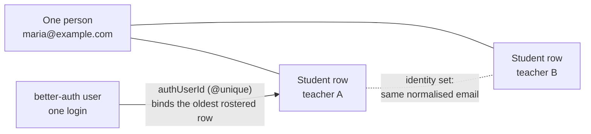

# Multi-teacher students — the identity model

A `Student` is a **per-teacher row**. A human being who studies with two
teachers is _two rows_, joined at read time by an identity aggregation — not one
global record. `students.email` is deliberately **not** globally unique.

This is the most consequential modelling decision in the schema, and it shapes
the route groups, the credit model and every compliance flow. It has been
settled twice; the rules below are not open for relitigation without a decision
record that reverses them.

## Two axes, easy to confuse

This document is about **one person, many per-teacher rows**. Separately, and
orthogonally, **teacher and student are mutually exclusive roles per login**
([D-38](../decisions/D-38.md)): one human cannot be a teacher-payee and a
student-payer under the same identity.

That exclusivity is enforced symmetrically — at sign-in linking
(`resolveLinkedStudent`), at checkout roster creation
(`findOrCreateRosterStudent`) and at manual roster add (`createStudentAction`) —
and fails loud with a clear message rather than silently merging two identities.

A student can still have many rows; a teacher and a student can never be the
_same_ row.

## The rules

- **One `Student` per (teacher, person)**, enforced by an advisory-locked
  find-or-create (`lib/students/find-or-create.ts`) rather than by a unique
  index — the invariant is per-(teacher, email) and the column is not unique.
- **`Student.authUserId` is `@unique`.** One login binds exactly one row: the
  oldest rostered match, resolved by `lib/auth/student-link.ts`.
- **The multi-teacher experience is read-time aggregation over the identity
  set.** `studentIdentityIds` (`lib/students/identity.ts`) is the linked row
  plus every non-moderated sibling row sharing the same normalised email.
- **Compliance flows use a wider set.** `studentComplianceIds` also includes
  moderated rows, because a disabled row still holds the person's data.
- **Read-side only.** Rows are never consolidated and fields never propagate
  between them. Same inbox ≠ same person — a parent can enrol two children under
  one address.
- **Never unify to a global `Student`, and never add a global unique index on
  email.** Consent scoping, archive semantics, per-teacher pricing and GDPR
  deletion all depend on per-teacher rows.

### The two sanctioned exceptions

Both are scoped to the **mailbox** rather than to the person, which is what
makes them safe:

| Applies across the identity set | Stays per row    |
| ------------------------------- | ---------------- |
| Email opt-out                   | WhatsApp consent |
| Lifecycle notification prefs    | Timezone         |

Email preferences describe an inbox, so they belong to the address. WhatsApp
consent is tied to the phone number captured at a specific checkout, so it
cannot be.

## What is built on it

**Portal aggregation.** `/my-classes` — home, booking detail, reserve,
reschedule and repurchase — reads and acts across the identity set, and a
repurchase lands the package on the correct sibling row. Sign-in heals
email-change drift (`lib/students/email-change.ts`).

**Compliance coverage.** Deletion requests fan out to every identity row
idempotently, and cancelling clears the whole set
(`lib/account-deletion/requests.ts`). A data export returns every row's snapshot
(`buildStudentIdentityExport`). The unsubscribe footer link silences every
same-email row. Notification preferences and email opt-in save across the set
from `/my-classes/account`.

**Consequences elsewhere.** The student portal has no "current teacher" concept
at all, which is why `(student)/` is its own route group rather than a section of
the teacher tree. Class credits are fungible only within a
`(teacher, identity set, class length)` pool. Duplicate detection and merging are
first-class features with their own integration suites.

Covered by `tests/students/identity.test.ts`,
`tests/students/compliance.integration.test.ts` and
`tests/redirects/email-opt-out-handler.test.ts`.

## Known limitations

- **Push tokens do not follow the identity set.** Device subscriptions register
  against the auth-linked row and the dispatcher looks them up by the
  notification's recipient row, so a sibling row's notification routes by email
  rather than push. Delivery is still guaranteed by the channel fallback, so
  this is an optimisation. The fix is to resolve tokens with
  `recipientId IN (identity set)` in the dispatcher's student branch, keeping
  the dependency-injection pattern its unit fakes rely on.
- **Timezone is per row, on purpose.** The portal displays in the linked row's
  zone; a sibling row's zone only affects that row's email formatting. Revisit
  only if a real student reports confusing times.

## Related

- [Data model](data-model.md) — tenancy, money, concurrency, migrations
- [D-38](../decisions/D-38.md) — role exclusivity
- [Student management](../features/student-management.md) — the product surface
- [Account settings](../features/account-settings.md) — export and deletion
