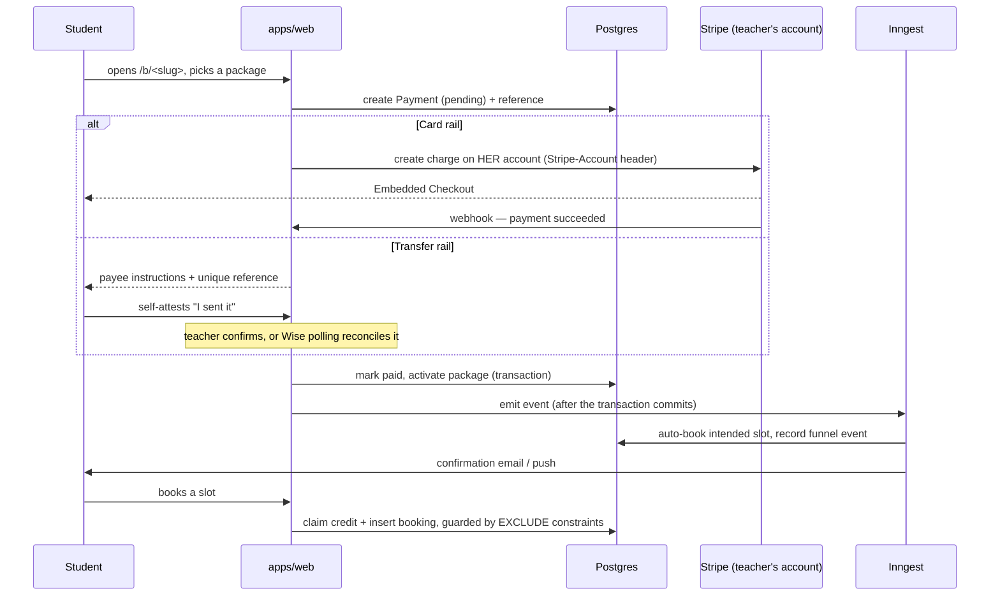
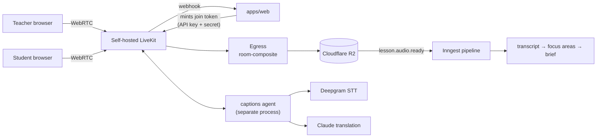

# Architecture overview

How SpiralClass is put together, why the boundaries fall where they do, and
which of those choices were forced by something real. For product behaviour see
[features](../features/); for the reasoning behind a specific choice see the
[decision record](../decisions/) it names.

This document describes what is running. Where a design was tried and reversed,
that is said, because the reversal is usually the more useful half.

## The shape, in one paragraph

One Next.js application talks to one Postgres database. Background work that
must outlive a request goes to Inngest. Real-time video is separate
infrastructure. Everything else — the teacher dashboard, the student portal, the
public booking funnel, the admin console and every route handler — is the same
deployment, the same process, the same connection pool.

There is no service mesh, no message broker to operate, no separate API tier and
no microservice boundary. That is a deliberate choice for a system maintained by
one person: every boundary is something that can drift, and a boundary that
exists for architectural tidiness rather than necessity is a permanent tax paid
for nothing.

## Components

### `apps/web` — the application

Next.js 15 on the App Router, React 19, deployed as a standalone Docker image.

**Route groups partition by audience, not by URL segment.**

| Group                  | Audience                            | Notes                                                                                                                                |
| ---------------------- | ----------------------------------- | ------------------------------------------------------------------------------------------------------------------------------------ |
| `(app)/`               | Teacher surfaces                    | `/dashboard`, `/payments`, `/settings`, `/onboarding`. The layout resolves or provisions the `Teacher` row and identifies to PostHog |
| `(student)/`           | Student portal (`/my-classes/*`)    | **No "current teacher" concept exists here** — a student can belong to several teachers                                              |
| `(auth)/`              | Sign-in and sign-up                 | Passwordless                                                                                                                         |
| `b/[slug]/`            | Public booking and checkout funnel  | Rendered in the _teacher's_ chosen language, never the visitor's                                                                     |
| `admin/`               | Internal operations                 | Gated by an `AdminUser` table plus an env allowlist                                                                                  |
| `api/**`               | Route handlers, grouped by audience | `teacher` · `student` · `chat` · `internal` · webhooks. One tree                                                                     |
| `r/`, `b/`, `m/`, `i/` | Short-link and redirect surfaces    | Token redirects, deep-link scoping                                                                                                   |

The student group having no current-teacher concept is not an omission. It falls
out of the identity model (below) and shapes every query in that tree.

**`src/middleware.ts` is load-bearing at exactly that path.** Next.js loads
middleware only from there; a copy at `apps/web/middleware.ts` compiles cleanly
and is silently never invoked. It carries the CSP nonce, the session-cookie
gate, auth redirects and `?ref=` attribution — all four would go dormant in
production without a single error. It has been left with a comment saying so.

**`src/lib/` is organised by bounded concern**, one folder per domain
(`payments/`, `booking/`, `cancellation/`, `subscriptions/`, `auth/`,
`notifications/`, `webhooks/`, `inngest/`, `video/`, `captions/`,
`transcription/`, `chat/`, `homework/`, `library/`, `marketing/`, …) plus flat
single-file utilities where a folder would be pretension (`money.ts`,
`dates.ts`, `slots.ts`). Tests sit next to the module they cover. Extending a
domain means adding to its folder, not starting another flat file at the root.

Two singleton resolvers are worth knowing because branching around them is the
bug they exist to prevent:

- **`entitlementsFor()`** (`lib/subscriptions/entitlements.ts`) is the only
  place Free / Pro / Founding / comped tier logic is decided. Nothing else
  branches on plan or tier.
- **`getStripeClient()`** resolves the platform Stripe credentials at every call
  site, so swapping the platform's legal entity is a credential change in the
  deployment environment rather than a code change. That has now happened twice.

### `packages/shared` — the business rules

Wire types, Zod validators, money arithmetic, pricing and subscription
configuration, the language registry, the i18n catalog, legal copy.
Presentation does not live here. Every module with non-trivial logic has a
colocated test.

It existed for exactly one reason: two clients had to agree on business rules
that could not be allowed to drift. There is one client now, and the package
stays — money math, validation, pricing and entitlement configuration belong
somewhere the route handlers and the UI both read, second client or not. Parity
as a _product_ rule is gone; shared business rules as an _architecture_ rule are
not.

It still carries wire types for a deleted route tree. They are inert and typed,
and sweeping them is its own change.

### `packages/livekit-captions-agent` — a separate process

A server-side LiveKit worker: it joins a room, streams audio to speech-to-text,
translates, and publishes captions back into the room as a data track. It is
deployed onto the LiveKit box, not into the web application, and is imported by
neither client.

### `packages/livekit-activity-cli` — an operator tool

A small standalone CLI for inspecting room and participant activity. Not
imported by anything.

## Data model

82 models, 2 migrations, 128 indexes and 23 unique constraints. Postgres on
Neon, through Prisma. **[`data-model.md`](data-model.md) is the full
treatment**; four properties matter for the shape of everything above it.

**Tenancy is application-level `teacherId` scoping, and nothing else.** There is
no row-level security, which is stated in [`SECURITY.md`](../../SECURITY.md) so
that a missing `where teacherId = ?` on an admin, webhook or service query is
treated as a reportable vulnerability rather than a style nit.

**A student belongs to several teachers.** A `Student` is a per-teacher row, and
one human studying with two teachers is two rows joined by a read-time identity
aggregation. This is why the student portal has no current-teacher concept at
all, and why credits are fungible only within a
`(teacher, identity set, class length)` pool —
[`multi-teacher-students.md`](multi-teacher-students.md).

**Money is integer minor units, with a currency-aware conversion on both
sides.** The platform prices in about 40 curated currencies and several of them
have no minor unit at all, so a conversion that assumes two decimals multiplies
the price by a hundred. What a teacher _charges her students_ and what she _pays
SpiralClass_ are separate concepts with separate configuration, separate Stripe
accounts and separate webhooks; they must never be conflated.

**Concurrency lives in the database.** A booking write is guarded by a partial
unique index and two `EXCLUDE` constraints, all of which mean "that slot is
taken". A pre-flight availability check is a courtesy; the constraint is the
guarantee. Applied migrations are never edited — Prisma checksums each file —
and production migrations run behind a Neon checkpoint branch
([D-95](../decisions/D-95.md)), because a code rollback never undoes a schema
change.

The `/admin/database` console generates a live ERD from the running schema
rather than from a checked-in diagram that would rot — [`ERD.md`](ERD.md).

## Request and money flow

### A student buys a package and books a class

Two boundaries in that diagram were bought with incidents.

**The charge is created on the teacher's account, not the platform's.** Until
2026-08-30 this was separate charges and transfers: money landed on the platform
balance and a `Transfer` forwarded the settled net. That imported a hard
constraint — a UK platform cannot `Transfer` to a Mexican connected account, and
Mexico is where the first teachers were. The fix was to stop needing a payout
circle at all. `lib/payments/transfer.ts` is deleted; there is no
balance-transaction read-back and no reversal-on-refund path, because there is
nothing to reverse. See [D-143](../decisions/D-143.md).

**The funnel ledger write happens after the payment transaction commits.** A
failed statement poisons a Postgres transaction even when its JavaScript error
is caught, so a best-effort analytics write took the payment down with it. It is
now strictly outside the transaction boundary, with a comment saying why.

### Video

The application talks to LiveKit through a `VideoProvider` interface selected by
`RTC_PROVIDER`. That abstraction earned itself: migrating from LiveKit Cloud to
the self-hosted box changed two configuration values and zero lines of
application code.

Recording is room-composite Egress writing straight to R2 with per-request
credentials. Captions are ephemeral — streamed, translated, published into the
room, never stored — which is why they sit outside the retention rules that
govern transcription.

Lesson insights are **derive-then-discard**: consented per-speaker audio is
captured, transcribed, turned into focus areas and a brief, and the audio is
deleted again unless the teacher opted into retention. Whether any voice is
captured at all is decided by the transcription flag and a recorded per-pairing
consent — guardian-only for a minor — not by the recording flag. Those two were
once coupled, which was a bug, and decoupling them is the fix.

## Cross-cutting concerns

### Authorisation

Application-level `teacherId` scoping is the **only** tenant isolation. There is
no row-level security. This is stated in [`SECURITY.md`](../../SECURITY.md) so
that a missing `where teacherId = ?` on an admin, webhook or service query is
treated as a reportable vulnerability rather than a style nit.

Admin access is two independent mechanisms — an `AdminUser` table for
capability-scoped staff, and an env allowlist for superusers. The built-in
allowlist constant is empty, so it cannot re-arm itself if rows are later
added.

Route handlers that take a plain `Request` gate on `@/lib/api/auth`
(`requireApiOnboardedTeacher`, which throws `ApiAuthError`) and wrap in
`@/lib/api/route`'s `handle()`, which turns that into a JSON body. Page routes
use `@/lib/auth`'s `requireOnboardedTeacher`, which redirects instead. Pick by
whether the caller is a `fetch()` or a browser navigation.

### Validation

Zod schemas in `packages/shared` are the wire contract, and both the server
actions and the route handlers validate against them. The reason they are shared
rather than defined per entry point is a real production bug: a route handler
that re-declared a schema and dropped a `.min(1)` the shared one had accepted an
empty availability ruleset and wiped a teacher's schedule. Grep the shared
schema before assuming a route's input shape.

### Configuration

Three tiers, split on one question — _is this a credential?_

| Tier                 | Where                                             | Example                                             |
| -------------------- | ------------------------------------------------- | --------------------------------------------------- |
| Non-secret           | `config/env/<env>.{build,runtime}.env`, committed | URLs, publishable keys, feature flags, project ids  |
| Secret               | Infisical, pushed to Fly secrets                  | Stripe secret key, LiveKit API secret, database URL |
| Infrastructure-owned | Written to Fly directly by OpenTofu               | Every `*_R2_*` and `LIVEKIT_EGRESS_S3_*` value      |

Committing the non-secret tier is the unusual choice and it is on purpose: a
deployment's configuration becomes reviewable in a diff instead of living only
in a dashboard. The third tier's invisibility has already caused one wrong
conclusion — a reader grepped the repository, found no Egress configuration, and
predicted a failure in a pipeline that was fully deployed — so the file headers
now say to check `fly secrets list` before concluding a variable is unset.

`src/lib/env.ts` is the runtime contract. Almost everything is optional and
degrades gracefully; only `assertProductionCredentials()` hard-fails, and only
on the production deployment.

### Internationalisation

Key-based catalog in `packages/shared`, resolved by `getT()` in Server
Components and `useT()` in Client Components. Two enforcement layers: an ESLint
rule that hard-fails new hardcoded strings on migrated files, and a ratcheted
guard test for everything else.

A teacher has **four independent language fields** and conflating any two of
them has broken production:

| Field                 | Means                  |
| --------------------- | ---------------------- |
| `target_language`     | What she teaches       |
| `teaching_language`   | What she teaches _in_  |
| `locale`              | What _she_ reads       |
| `booking_page_locale` | What her _buyers_ read |

The fourth exists because deriving the public funnel's language from her own
locale was shipped and was wrong: the platform's Mexican teacher reads Spanish
and sells Spanish lessons to English speakers, so her buyers read English while
she reads Spanish. What her buyers read cannot be inferred from anything else on
her row, so it is her own setting.

Three separate renderings must agree on that one value — the server pages
(`getPublicFunnelT`), the client half (`b/[slug]/layout.tsx`) and the social
card (`b/[slug]/opengraph-image.tsx`) — and all three derive it from
`booking_page_locale`. The social card is generated with **no visitor present**,
which is exactly why a per-visitor rule reintroduces the split-language funnel
this mechanism exists to prevent.

### Background processing

The dividing line is durability: anything that must
survive the request ending, retry on failure, or run on a schedule goes to
Inngest. Everything else stays in the request.

That covers booking side-effects, reminder scanning and dispatch, payment
reconciliation, Wise statement polling, the transcription pipeline stages,
package-expiry and homework nudges, subscription sweeps, account deletion and
calendar sync.

### Observability

Sentry for errors, with deliberate noise filters and a scrubber; PostHog for
product analytics, proxied through the app's own `/ingest` path so an ad
blocker does not silently erase the funnel. Production probes run at promote
time — the moment a deploy could have broken something — rather than on a cron
nobody reads.

## How this evolved, and what was reversed

The decision log is the real record; this is the shape of it.

- **Hosting**: Vercel + Supabase → Fly.io + Neon ([D-70](../decisions/D-70.md),
  [D-89](../decisions/D-89.md)). Supabase is fully decommissioned. There is still
  no `VERCEL_ENV` branch — production versus preview is decided by `APP_URL` —
  and that decoupling is what later let Vercel come back as a **second
  production target holding no domain** ([D-175](../decisions/D-175.md)),
  needing no application change at all. Production serves from Fly.
- **Payments**: separate charges and transfers → direct charges on Accounts v2
  ([D-143](../decisions/D-143.md)). The platform stopped touching the money.
- **Platform entity**: UK → Mexico → UK
  ([D-58](../decisions/D-58.md)), and platform billing MXN → GBP
  ([D-99](../decisions/D-99.md)). Because every call site resolves credentials
  through one function, each swap was configuration rather than code.
- **Video**: LiveKit Cloud → self-hosted ([D-94](../decisions/D-94.md)). Two
  config values, no application code.
- **Subject scope**: English-teaching → language-agnostic
  ([D-72](../decisions/D-72.md), [D-73](../decisions/D-73.md)). A teacher's
  subject became a BCP-47 code from one registry.
- **CI**: GitHub Actions → a free Oracle box → a paid Hetzner pool →
  GitHub-hosted again → the maintainer's laptop with no workflows at all
  ([D-119](../decisions/D-119.md), [D-129](../decisions/D-129.md)) → back onto
  runners once the repository went public
  ([D-157](../decisions/D-157.md), [D-161](../decisions/D-161.md)). The move to
  the laptop happened because the Actions allowance emptied mid-month and
  production went eleven days without a database backup while the public
  repositories stayed green; the move back happened because a public
  repository's minutes are free and `ubuntu-latest` builds the amd64 image
  natively instead of under QEMU — with the checks still defined in one
  registry the workflows call rather than restate.
- **A second client**: strict parity → web-only, then the client and its
  220-route server surface deleted. Reversed on measurement, not taste.

The pattern worth noticing is that most reversals were possible cheaply because
the thing being swapped sat behind one resolver — `getStripeClient()`, the
`VideoProvider` interface, `entitlementsFor()`, `getEmailClient()`. The ones
that hurt were where a constraint had been absorbed into the design rather than
isolated behind an interface.

## Related

- [Decision records](../decisions/README.md) — the reasoning, in full
- [Feature behaviour](../features/) — what the product does
- [Multi-teacher students](multi-teacher-students.md) — the identity model
- [ERD generation](ERD.md) — the live schema diagram
- [Data model](data-model.md) — tenancy, identity, money, concurrency
- [Development workflow](../development/workflow.md) — how a change ships
