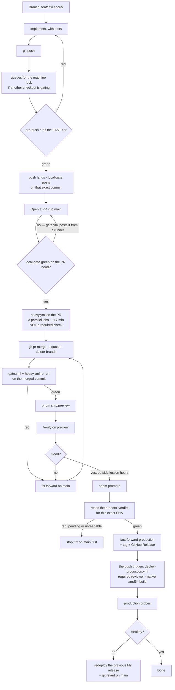

# How a change reaches production

One sequence, every time. You should never have to decide _how_ to ship — only
_what_ to ship. Every feature and every bug takes the same path, and the path is
short by design.

This document is the _what to do_. The _why_ is in the
[decision records](../decisions/README.md) it cites; where this file and another
document disagree, the decision record wins and one of them is a bug.

```
branch → implement + tests → push (the fast gate runs here)
  → PR into main → local-gate green → squash-merge
  → verify on preview → pnpm promote → production
```

## The branching model

Short-lived branches off `main`, deleted after merge, prefixed by intent.

| Prefix      | For                                         | Example                       |
| ----------- | ------------------------------------------- | ----------------------------- |
| `feat/`     | A new capability                            | `feat/student-invites-csv`    |
| `fix/`      | A bug fix                                   | `fix/availability-empty-save` |
| `hotfix/`   | An urgent production fix                    | `hotfix/checkout-500`         |
| `chore/`    | Deps, config, tooling, no product behaviour | `chore/bump-next-15-6`        |
| `refactor/` | Behaviour-preserving restructure            | `refactor/slots-extract`      |
| `docs/`     | Docs only                                   | `docs/workflow-rewrite`       |

- **`main` is the trunk.** Every change lands through a pull request — docs
  included. There is no direct-push exception.
- **`production` is a release pointer, not a place you work.** It is
  fast-forwarded by `pnpm promote` and by nothing else. Never protect it;
  protection blocks the fast-forward.
- **One branch = one PR = one logical change.** Large features split into
  vertical slices, each independently shippable and independently reversible.
- Squash-merge, so `main` stays linear. There are no release branches and no
  gitflow: for a trunk feeding one preview and one production, `develop` and
  `release/*` are pure overhead.

## The gate

**`scripts/ci/steps.mjs` is the single registry of what "green" means**, and
`scripts/ci/gate.mjs` runs it. Nothing else defines a check — not a workflow,
not a hook, not a script. A guard test fails on a workflow that restates a step.

There are two tiers.

**Fast** — Prisma client, formatting, README counts, typecheck, lint, web unit
tests with coverage floors, diff coverage on new code, package tests, credential
scan, dependency audit. Seconds to a couple of minutes.

**Heavy** — the mutation spot-check, the real-database integration suite
(Postgres, a production `next build`, migration drift) and the three browser
suites (end-to-end, visual regression, accessibility). Twenty to forty minutes
on one machine; about seventeen as three parallel runner jobs.

Both tiers run in both places:

| Where                                                         | Runs  | Produces                       |
| ------------------------------------------------------------- | ----- | ------------------------------ |
| `.githooks/pre-push`, on every push                           | fast  | the `local-gate` commit status |
| `.github/workflows/gate.yml`, on every PR and push to `main`  | fast  | the same `local-gate` status   |
| `.github/workflows/heavy.yml`, on every PR and push to `main` | heavy | three parallel job results     |

The two fast producers cannot disagree about anything but timing, because they
run the same registry. The hook is what makes the checks run _before_ a push
rather than after; the workflow is what makes a laptop-less day a complete
substitute rather than a stranded pull request.

`heavy.yml` derives its matrix from the registry (`gate.mjs --tier heavy --list
--json`) rather than naming jobs, so a heavy step added to `steps.mjs` gets a
runner in the same commit.

### One heavy job at a time

Several worktrees share one machine. The gate, the integration suite and the
browser suites take a **machine-wide lock**
([D-146](../decisions/D-146.md)), so a second push **queues** rather than
competing — it says so, and reprints every thirty seconds.

- `pnpm gate:lock` — who holds the machine and who is in line.
- **A push that seems to hang is almost always waiting.** Read the output before
  reaching for Ctrl-C, and never reach for `SKIP_GATE=1`.
- The lock is advisory and knows nothing about a `pnpm dev` holding port 3000,
  which will collide with the browser suites exactly as it always did.
- The Turborepo cache is shared across every checkout, so work done in one
  worktree is a cache hit in the others.

### Escape hatches, and what each costs

| Command                   | Effect                                | Cost                                                    |
| ------------------------- | ------------------------------------- | ------------------------------------------------------- |
| `pnpm gate --allow-dirty` | Fast tier against an uncommitted tree | None. Never posts a status                              |
| `pnpm gate --only <step>` | Re-run one step after fixing it       | None. `pnpm gate --list` names them                     |
| `GATE_TIER=full git push` | Run the heavy suites at push time     | Holds the machine 20–40 min; every other session queues |
| `SKIP_GATE=1 git push`    | Run nothing, post nothing             | The PR cannot merge until some gate posts a status      |
| `pnpm gate --no-lock`     | Skip the queue                        | Only when you have reasoned about what else is running  |

`SKIP_GATE=1` is not a time-saver. It defers the same failure to a pull request
that then cannot merge.

## Production-risk changes

One question decides it: **if this is wrong, does a real user lose money, a
booking, or access?** If yes, it is Tier 2. When in doubt, Tier 2.

```
apps/web/src/lib/{payments,stripe,subscriptions,pricing,booking,cancellation,auth,webhooks,inngest}/**
apps/web/src/lib/{auth,slots,csp}.ts
apps/web/src/middleware.ts
apps/web/prisma/**
apps/web/src/app/api/{stripe,inngest}/**
```

`CLAUDE.md` is the single source of that list.

**The tier does not change which gate runs** ([D-146](../decisions/D-146.md)).
It used to: the pre-push hook escalated a Tier 2 branch to the heavy tier, which
on a shared machine fired a forty-minute run at an arbitrary moment. Since
[D-161](../decisions/D-161.md) the heavy suites run on a runner for every pull
request regardless of tier, so escalating locally buys only earliness.

What the tier still decides is **judgement**:

- Whether to spend a `GATE_TIER=full git push` — worth it when a migration or a
  payments change would be expensive to find after a force-push.
- Whether to have two risky changes in flight at once, which is two ways to
  break production and a merge order to reason about.
- Whether to ship it now at all. **No risky-path promote during lesson hours.**

## The sequence



### 1. Build

Implement on web. It is the only place a user-facing change can ship — do not
add a second client, a native dependency, or a CI step that builds one.

**Write tests for the new behaviour**, and for the regression if it is a fix. A
change is not done without them. `pnpm test` for fast feedback; `pnpm gate
--allow-dirty` for the real answer early.

### 2. Push

`git push -u origin <branch>`. The hook runs the fast tier against the commit
being pushed, and nothing leaves the machine if it is red. There is no separate
"remember to verify first" step — that was the step that got forgotten.

On success it detaches a process that posts the `local-gate` status once the
commit reaches origin.

### 3. Open the pull request

`pnpm pr` does steps 2 and 3 together: name the branch, push, open or update the
PR, wait for the status. It **never** merges, deploys or promotes, and a guard
test fails if `open-pr.sh` grows a merge, a deploy or a gate bypass.

Fill the PR template — summary, test plan, security checklist. Branch protection
requires `local-gate` green **on the head commit**, so a later push re-blocks the
PR until that commit is certified too.

**Read the PR's heavy run before merging.** It is deliberately _not_ a required
check, so nothing stops you merging over a red one — but it is the only thing
that sees a real database or a browser.

### 4. Merge

```bash
gh pr merge <n> --squash --delete-branch
```

There is no batch command. [D-162](../decisions/D-162.md) deleted `pnpm ship-pr`
because `heavy.yml` runs the suites it existed to run, on a runner, on every
pull request and every push to `main`. Batching then bought nothing but delay.

Both workflows re-run against the merged commit, and **that pair is what
certifies a release**: a pull-request run tests HEAD merged with base _as of that
moment_, so if `main` moved in between, the tree that landed is not the tree that
was tested. `pnpm promote` therefore reads the **push** runs for the exact commit
it is promoting.

Running the heavy suites against `main` is also the only thing that catches a
combination broken though each half was green alone.

**What this accepts:** a production-risk commit can reach `main` having had only
the fast tier. Preview is the rehearsal environment and finding out there is the
point; nothing reaches production without the heavy tier green on that commit.

### 5. Preview

⚠️ **Merging to `main` does not currently refresh preview.**
[D-157](../decisions/D-157.md) gave `deploy-preview.yml` its push trigger back
and its own addendum suspended it hours later, because preview and preview's
database are moving to the Oracle box ([D-150](../decisions/D-150.md)) and
shipping to the retired target is the thing not wanted. `workflow_dispatch` is
all that remains until that box serves.

So run **`pnpm ship:preview`** when you need preview fresh. A hand pass hits the
_deployed_ preview, not your checkout, and a stale one reads as a product bug
rather than a missing deploy.

⚠️ `pnpm deploy:preview` also exists and is **not** what you run: it deploys to
Fly by hand, cross-building the amd64 image under QEMU at 20–30 minutes.

Then verify: the relevant `/admin/uat` section, and your own eyes on the change.

### 6. Promote

Outside lesson hours, on an up-to-date `main`:

```bash
pnpm promote
```

It reads the **runners' verdict** for this exact commit — the Gate and Heavy
workflows' push runs, both green ([D-162](../decisions/D-162.md)) — rather than
re-running the suites. Then it confirms, fast-forwards `production`, and stamps a
`vYYYY.MM.DD.N` tag and a GitHub Release.

**That push is the trigger.** `deploy-production.yml` runs
`scripts/fly-deploy.sh` after a required reviewer approves: Neon checkpoint,
migrations, a **native amd64** image, the Fly deploy, the Inngest sync, then the
production probes. `pnpm promote` watches that run and exits non-zero if it goes
red, so a green promote means production is serving.

- `--force-gate` runs the full tier here instead of reading the verdict — the
  offline and recovery path, and still the QEMU cross-build.
- **`gh` unavailable means the verdict cannot be read**, and that is a refusal
  rather than a pass.
- If the deploy fails _after_ the fast-forward, the branch moved and the app did
  not: re-run the workflow, or run `./scripts/fly-deploy.sh production
--gate-already-passed` from the laptop. Same script either way.

Then watch the probes, Sentry and PostHog for about fifteen minutes.

### If something is wrong in production

**Rollback beats a rushed fix.** Deployments are immutable — redeploying the last
good Fly release is faster and safer than a hot code change. Do that first, then
fix forward without adrenaline.

```bash
fly releases -a agendaprofe
fly releases rollback          # or: fly deploy --image <previous>
```

Then `git revert` the offending commit and take it through the normal path. **A
hotfix still goes through the gate** — the gate is exactly what stops a panic fix
from causing a second incident.

⚠️ **A code rollback never undoes a migration.** If the bad deploy ran one,
restore the pre-migration Neon checkpoint —
[`DB_BACKUP_RESTORE.md`](../deployment/DB_BACKUP_RESTORE.md) — and read
[`INCIDENT_RESPONSE.md`](../deployment/INCIDENT_RESPONSE.md).

## Feature flags

A feature too big for one clean pull request splits into vertical slices behind
a flag (`flagEnabled("FLAG_<NAME>")`). Slices merge to `main` and reach preview
without being exposed; the flag is on in preview and off in production until the
whole feature is ready. **The flag flip is the launch**, decoupled from the
deploy.

## What blocks what

- **Blocks the merge:** the `local-gate` status, bound to the exact commit the PR
  wants to merge.
- **Blocks production:** the Gate and Heavy workflows, both green on the _push_
  run for the exact commit being promoted. `pnpm promote` fails closed — a
  pending run, a missing one, or an answer it cannot read all stop it.
- **Blocks nothing, by design:** the heavy run on a pull request, and the
  maintenance staleness nag.

## Nothing is scheduled

There is no cron, no launchd agent and no `schedule:` trigger anywhere
([D-129](../decisions/D-129.md)). A laptop schedule is one nobody owns, and a
shut laptop misses it as thoroughly as it misses everything else. Two former
crons are commands:

```bash
pnpm local synthetic     # the production probes (a promote runs these itself)
pnpm local sweep         # unit suites + audit against today's clock
pnpm local:status        # when each last succeeded
```

Every run writes a receipt, and `pnpm gate` prints one line per job overdue by
more than a week — at a moment somebody is provably at the keyboard. It never
fails the gate.

**There is deliberately no backup job.** Neon backs production up with
point-in-time recovery plus the pre-migration checkpoint;
`scripts/local/backup-prod-db.sh` is an unregistered on-demand tool, left
unregistered so nothing nags about a decision already made. See
[`LOCAL_AUTOMATION.md`](../deployment/LOCAL_AUTOMATION.md).

## Releases and versioning

Every promote stamps an annotated `vYYYY.MM.DD.N` tag (N is that day's promote
count) and opens a GitHub Release with auto-generated notes. That gives a named
auditable history, a rollback target by name, and release notes for free.

You still ship all of `main` together. This is continuous promotion of the
trunk; the tag is a _record_ of a promote, not a branching strategy.

## Where to go deeper

- **Why the workflow is shaped this way:** [D-119](../decisions/D-119.md) (the
  gate is one program), [D-129](../decisions/D-129.md) (every workflow deleted),
  [D-146](../decisions/D-146.md) (one heavy job at a time),
  [D-157](../decisions/D-157.md) (the workflows came back),
  [D-161](../decisions/D-161.md) / [D-162](../decisions/D-162.md) (the heavy
  suites moved to runners).
- **The tests themselves:** [testing.md](testing.md)
- **Release and preview operator runbook:**
  [`RELEASE_AND_STAGING.md`](../deployment/RELEASE_AND_STAGING.md)
- **Branch protection:** [`BRANCH_PROTECTION.md`](../deployment/BRANCH_PROTECTION.md)
